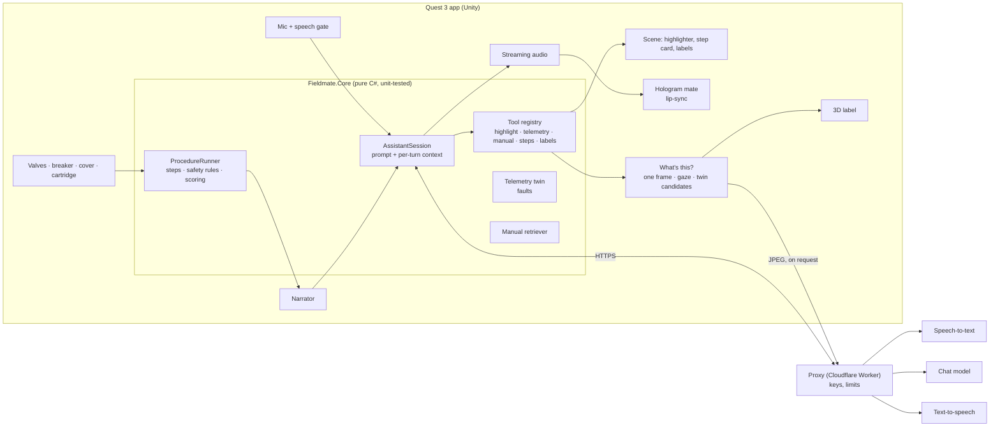

# Fieldmate

An AI-assisted mixed-reality maintenance companion for Meta Quest 3. A digital twin of an industrial pump skid stands
in your real room; a small holographic mate walks you through a real maintenance procedure, checks every action you
take on the machine, stops you when something is unsafe, and answers questions by voice from the machine's manual.

Built with Unity 6, OpenXR (Meta feature group), XR Interaction Toolkit 3 and XR Hands. Work in progress towards
v0.1.0: see the issues and milestones.


## What happens in the headset

1. **Setup, one step at a time.** The headset checks the room scan; the mate materialises in front of you, introduces
   itself, and you point it to where it should stay. It then asks for the machine: you point at the floor and the
   skid appears, sized to fit the free space. The mate briefs the job and step 1 starts.
2. **The procedure** (replace a stuck relief valve cartridge, 8 steps): inspect by looking, lock out the breaker
   with both hands, close the inlet, read zero on the gauge, take the cover off, seat the new cartridge, restore and
   verify. Steps complete only from what you actually do; out-of-order actions are recorded, and parts guarded by a
   safety rule (lockout before the inlet valve or the cover) stay still until the rule is met.
3. **The mate** speaks each next step, interrupts on a violation, and answers questions ("why is the pressure high?",
   "where is the breaker?", "what is what?") with tool calls: it highlights parts, reads live telemetry, opens manual
   sections, logs notes. Its lips follow the voice; a speech bubble shows the words as they are spoken. Without a
   network it falls back to scripted answers from the manual.
4. **"What's this?"** Look at something and ask. The app takes one camera frame, asks a vision model which of the
   nearby machine parts (or what else) it is, and pins the answer as a label on the spot for 20 seconds. If the model
   is unsure, the twin's own part data answers instead. A red "Camera" pill shows every time a frame is taken.
5. **Controls stay out of the way**: a hand menu on the left hand (palm towards you, or the left menu button) holds
   Start/Restart, Move machine, occlusion, performance stats, part labels and the camera (local-only mode).

## Architecture



- **`Fieldmate.Core`**: procedures, AI orchestration (session, tools, prompts, fallback, eval), manual retrieval
  and the telemetry model. No UnityEngine beyond maths; covered by EditMode tests.
- **`Fieldmate.Unity`**: XR (placement, presence, pointers, hand menu, occlusion), interaction, the assistant (voice
  loop, hologram, speech bubble) and UI, all built in code with a small UI kit.
- **`Fieldmate.Editor`**: builders that generate the bench scene and prefabs (nothing hand-edited), project setup,
  the AI eval runner.
- **`tools/proxy`**: the Worker that holds the provider keys; the app never ships them.

## Privacy: what leaves the headset

| What | When | Goes to |
|---|---|---|
| Your voice (a short WAV clip) | Only while you hold the talk button or pinch | Proxy → speech-to-text (Deepgram) |
| The transcript, matching manual sections and the machine's state (step, telemetry, the part you look at) | Each assistant turn | Proxy → chat model (Anthropic) |
| The assistant's reply text | Each spoken reply | Proxy → text-to-speech (ElevenLabs) |
| **One camera frame** (JPEG, at most 640 px) and the names of nearby parts | **Only when you ask "What's this?"**, never in the background. A red "Camera" pill shows every time | Proxy → vision model (Anthropic) |

- **Stays on the headset:** the passthrough video, the room scan and scene mesh, spatial anchors, hand tracking.
  A captured frame lives only in memory, overwritten by the next one; nothing is written to storage.
- **The proxy** (`tools/proxy`) holds the provider keys and stores no content. It keeps daily request counts for its
  cost caps and uses the caller's IP address only for the per-minute rate limit. Providers process requests under
  their API terms.
- **Local-only mode** (Camera button in the hand menu): the camera is never read and no image leaves the headset;
  "What's this?" answers from the twin's own part data. Voice still uses the cloud. Without a proxy configured, the
  assistant runs on scripted answers and nothing leaves the headset at all.
- The camera needs the Horizon OS `HEADSET_CAMERA` permission. Deny it and everything else keeps working.

Decisions live in [`docs/adr/`](docs/adr): OpenXR route (001), Unity version (002), voice providers and proxy (003).
The performance budget and measurements are in [`docs/perf/`](docs/perf).

## Build and run

Requires Unity 6000.4.9f1 with Android Build Support (see `ProjectSettings/ProjectVersion.txt` and ADR-002) and a
Quest 3 on Horizon OS v74 or later.

```
tools/test.sh      # EditMode + PlayMode tests
tools/build.sh     # Android APK -> Builds/
tools/install.sh   # adb install -r + launch
```

The assistant needs a proxy: copy `Assets/_Project/Secrets/keys.json.template` to `keys.json` and set the proxy URL
(`tools/proxy` deploys one). Without it the app runs with scripted answers. After changing project settings by hand,
`Fieldmate > Configure Project for Quest` re-applies the Quest defaults; `Fieldmate > Build Assistant Bench Scene`
regenerates the scene.

`Fieldmate > Run AI Eval` sends the 25 utterances in `Assets/Fieldmate.Tests/AIEval/utterances.json` to the real
model and writes a report to `docs/eval/`; CI runs the same cases against a mocked model on every pull request.

## Licence
MIT for the code in this repository. Third-party assets are not included; see [`docs/ASSETS.md`](docs/ASSETS.md).
